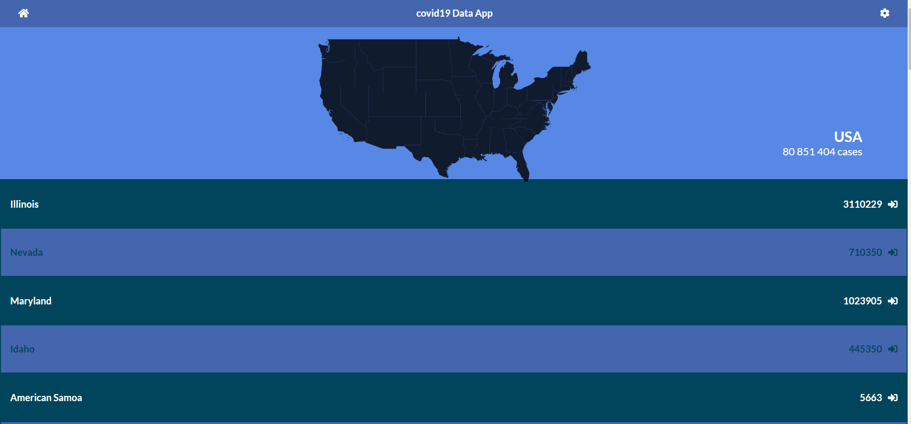

# Covid-19 Data App

This project is a responsive web application to show a list of current covid casses classified by countries and regions, according to the data provided by [Johns Hopkins University](https://systems.jhu.edu/research/public-health/ncov/).
It is a single-page application (SPA) built with React and Redux.

The original design idea is based on a template by [Nelson Sakwa on Behance](https://www.behance.net/sakwadesignstudio) and it licenced by [Creative Commons](https://creativecommons.org/licenses/by-nc/4.0/).

When the page loads, the webapp's home page shows the list of categories that could be filtered out by country name. When the user clicks (or taps) on a category item, the application navigates to the details page.


In the details page, the webapp retrieves data from the API to show detailed data of covid cases in the category. When the user clicks on the "Back" button (<), the user navigates to the home page.



you can watch my video presentation here[this video](https://www.loom.com/share/fc770c3bd8cf4543b1c050ab5e52aa0b)


## Live Demo
[Covid Tracker Live Demo](https://covid-19-data-app.netlify.app/)

## Built With
- React
- Redux

## Getting Started
**step1** cloning the project:
```
git clone https://github.com/Usorfaitheloho/covid-19-data-app.git
```
**step2** buile the project:
```
npm run build
```

Builds the app for production to the `build` folder.
The build is minified and the filenames include the hashes.

```
npm start
```
Runs the app in the development mode.
Open [http://localhost:3000](http://localhost:3000) to view it in your browser.

The page will reload when you make changes.
You may also see any lint errors in the console.

**step3** test
```
npm test
```
Launches the test runner in the interactive watch mode.
## Author
**Faith Usor**
- GitHub: [@githubhandle](https://github.com/usorfaitheloho)
- Twitter: [@twitterhandle](https://twitter.com/faith-usor16)
- LinkedIn: [LinkedIn](https://www.linkedin.com/in/faith-usor/)

## Contributing

Contributions, issues, and feature requests are welcome!

Feel free to check the [issues page](../../issues/).

## Show your support

Give a ⭐️ if you like this project!

## License

This project is [MIT](./MIT.md) licensed.
